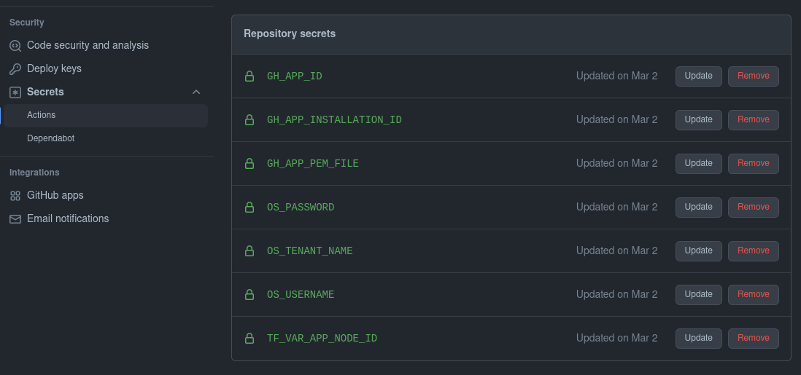

# Managing GitHub organization with Terraform

This setup is based on
[hashicorp/learn-terraform-github-actions](https://github.com/hashicorp/learn-terraform-github-actions),
but relies exclusively on GitHub Actions without communicating with Terraform
Cloud.

# 1. Cloning Terraform repository

Clone this repository to your GitHub organization and adjust variables to your
liking.

# 2. GitHub App configuration

Github App will be used by Terraform to provision organization.

## Creating new GitHub App

It can created by following [this guide](https://docs.github.com/en/developers/apps/building-github-apps/creating-a-github-app).
Application should be limited to only one account. Permissions depend on what
resources you plan to manage with Terraform, but sensible base is:

- Repository/Administration - Read and write
- Repository/Contents - Read and write
- Repository/Metadata - Read-only
- Repository/Projects - Read-only
- Repository/Single file - CODEOWNERS
- Organization/Administration - Read and write
- Organization/Blocking users - Read and write
- Organization/Members - Read and write
- Organization/Projects - Admin

After creating App you may need to [install it in
organization](https://docs.github.com/en/developers/apps/managing-github-apps/installing-github-apps).

Github App will use [private key](https://docs.github.com/en/developers/apps/building-github-apps/authenticating-with-github-apps)
for authentication. In order to properly authenticate with Terraform GitHub
provider you will need:

- GitHub App ID(`github_app_id` in `variables.tf`)
- GitHub App installation ID(specific to organization,
  `github_app_installation_id` in `variables.tf`)
- GitHub App private key in PEM format (`github_app_pem_file` in `variables.tf`)

## Getting GitHub App node ID

Node ID is used in GraphQL API. Some Terraform resources like
[github_branch_protection](https://registry.terraform.io/providers/integrations/github/latest/docs/resources/branch_protection)
may require node IDs for access control lists. Knowing you App node ID will be
handy, when you want to allow some actions only to it. While there maybe some
better way of getting node ID, you can use your newly created App to query
itself for node ID. First generate [JWT token](https://docs.github.com/en/developers/apps/building-github-apps/authenticating-with-github-apps#authenticating-as-a-github-app)
and then [query /app endpoint](https://docs.github.com/en/rest/reference/apps).

# 3. Configuring state backend

Terraform requires backend to store configuration state. This example repository
uses OpenStack Swift. Consult [Terraform documentation](https://www.terraform.io/language/settings/backends)
and choose your preferred backend. Keep in mind that you will also have to pass
access credentials as GitHub secrets in order to use it.

# 4. Configuring Terraform repository secrets

Visit `Repository` -> `Settings` -> `Secrets` -> `Actions` and ensure that at
least the following variables are configured:

- GH_APP_ID
- GH_APP_INSTALLATION_ID
- GH_APP_PEM_FILE
- TF_VAR_APP_NODE_ID
- and secrets required by your backend. Screenshot below uses OpenStack access
  credentials.

# GitHub Actions workflows

Workflows are divided into 3 files:

- `.github/workflows/terraform-checks.yml` - Validates pull request without
  accessing repository secrets.
- `.github/workflows/terraform-plan.yml` - Generates Terraform plan. This
  workflow is launched only after user whitelisted in file comments pull request
  with _/plan_ message. It ensures that untrusted code from pull request won't
  be run automatically with repository secrets. See [this article](https://securitylab.github.com/research/github-actions-preventing-pwn-requests/)
  for more details.
- `.github/workflows/terraform-apply.yml` - Enforces state after pushing code to
  main branch.
